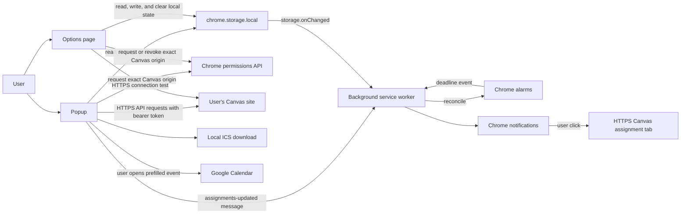

# Canvas Deadline Copilot architecture

This document describes the runtime architecture of the Chrome extension released from the `extension/` directory. Canvas Deadline Copilot is a Manifest V3 extension built with React, TypeScript, and Vite. The installed extension does not depend on the repository's legacy web frontend or Python backend.

## Runtime boundaries

Vite produces three extension entry points:

- `popup.html` loads the React popup.
- `options.html` loads the React options page.
- `background.js` is the Manifest V3 extension service worker.

The popup and options page are short-lived extension documents. Durable state belongs in `chrome.storage.local`, and durable reminder execution belongs to Chrome alarms rather than in-memory timers. The service worker can stop whenever it is idle, so its in-memory queues coordinate only the current worker lifetime; persisted cache, settings, delivery history, and Chrome alarms remain the source of truth.

The extension performs no scheduled background Canvas sync. A user starts each Canvas connection test or assignment sync from an extension page.

## Component map

## Popup

The popup is the primary deadline dashboard. On mount, it reads the saved Canvas settings, validated assignment cache, and reminder settings in parallel. It does not automatically contact Canvas.

When the user chooses **Sync assignments**, the popup:

1. Requests optional host access for the exact HTTPS Canvas origin in the saved settings.
2. Calls the Canvas API client for active courses and their assignments.
3. Normalizes and validates the returned data.
4. Replaces the local assignment cache after a successful or usable partial sync.
5. Sends a data-free `canvas-deadline:assignments-updated` runtime message.
6. Updates the current popup view.

The service worker also observes assignment-cache changes directly. This storage event is the reliable reminder-rebuild trigger if runtime messaging has no receiver or the background worker is being restarted.

Filtering, status classification, sorting, and course selection happen locally against the cache. The popup renders assignment and calendar links only from normalized HTTPS URLs. Calendar export is also initiated from the popup.

## Options page

The options page owns configuration rather than deadline browsing. It loads and saves:

- the Canvas base URL and API token;
- whether browser reminders are enabled; and
- the selected reminder windows: 7 days, 24 hours, 2 hours, and 30 minutes.

The Canvas URL is reduced to an HTTPS origin. A saved token is never repopulated into the form; a blank replacement-token field keeps the existing token only when the Canvas origin is unchanged. **Test connection** requests access to that exact origin and calls Canvas's current-user endpoint. Saving credentials does not itself sync assignments. Changing either the saved Canvas origin or token invalidates the previous assignment cache so data from different Canvas accounts is not combined. Changing the saved origin also triggers a best-effort revocation of access to the previous origin.

The options page also presents connection/reminder status and non-sensitive diagnostics derived from the validated cache and Chrome alarm list. Diagnostics include the last successful sync timestamp, cached assignment count, scheduled reminder-alarm count, and the latest stored partial-sync warning. They do not include the API token.

Data-clearing controls and their exact effects are described in [Privacy](PRIVACY.md#retention-and-user-controls).

## Canvas API client

The Canvas client in `extension/src/lib/canvas.ts` makes direct `GET` requests to the user-supplied Canvas origin. It uses the token only in an `Authorization: Bearer …` request header and asks for JSON responses.

The client uses these Canvas API paths:

- `/api/v1/users/self` for connection testing;
- `/api/v1/courses` for active courses; and
- `/api/v1/courses/{courseId}/assignments` for assignments.

Course and assignment collections are paginated. Every initial request, redirect response URL, and `Link` header continuation must remain HTTPS, contain no embedded URL credentials, and match the configured Canvas origin. Assignment links must also be HTTPS and same-origin before they enter the normalized cache.

Assignment requests for different courses run concurrently. If some courses fail, assignments from successful courses are retained and `failedCourseCount` records a concise partial-sync warning. If every syncable course fails, the sync fails and the previous cache is left unchanged.

## Local storage and cache

All extension-managed persistent data uses `chrome.storage.local`; the extension does not use `localStorage` or `chrome.storage.sync`.

| Storage key | Contents | Main consumers |
| --- | --- | --- |
| `settings` | Canvas HTTPS origin and API token | Popup, options page, Canvas client |
| `assignmentCache` | Courses, normalized assignments, last successful sync time, and optional failed-course count | Popup, diagnostics, service worker |
| `assignmentNotes` | Assignment-ID-to-note map retained by the storage layer; the current popup does not expose note editing | Storage helpers |
| `reminderSettings` | Enabled flag and selected reminder windows | Popup, options page, service worker |
| `reminderDeliveryHistory` | Delivered alarm identifiers, delivery timestamps, and an optional sanitized HTTPS assignment URL | Service worker |

Each read validates the stored shape before returning it. Invalid credentials, reminder settings, notes, cache entries, and delivery records fall back to safe empty/default values. The storage layer makes a best-effort attempt to remove or replace corrupted values so the same corruption is not processed indefinitely.

The assignment cache is a snapshot, not a live view of Canvas. The last successful snapshot remains available when a later sync fails. No-date and unpublished assignments are handled without creating reminder alarms.

## Background service worker

The background service worker is responsible only for reminder lifecycle and notification-click routing. It does not fetch Canvas courses or assignments.

Reminder reconciliation is requested:

- whenever the service-worker module loads;
- on extension installation or update;
- when the Chrome profile starts;
- after the assignment-updated runtime message; and
- when the assignment cache or reminder settings change in local storage.

Rebuild requests are serialized to avoid overlapping alarm mutations. Reconciliation loads the validated cache, reminder settings, delivery history, and current Chrome alarms. It then computes a deterministic desired schedule, clears stale extension-owned alarms, preserves matching alarms, and creates missing alarms. Alarm operations are awaited; a partial API failure does not prevent other clear/create operations, and a later rebuild retries work that is still missing.

Alarm handling is separately serialized. Before showing a notification, the worker re-reads persisted state and verifies that:

- the alarm identifier is valid;
- reminders remain enabled for that window;
- the reminder has not already been delivered;
- the due time has not passed; and
- the cached published assignment still matches the course, assignment, and due timestamp in the alarm.

The notification is created before its delivery record is written. This prevents a failed notification API call from permanently suppressing a reminder that was never shown.

## Alarms and notifications

Reminder alarm names encode the course ID, assignment ID, selected window, and due timestamp. Including the due timestamp versions the alarm: changing a Canvas due date makes the old alarm stale and produces a new deterministic identifier.

Only published assignments with valid future due dates are eligible. A window is scheduled only when its notification time is still in the future. Consequently, overdue assignments, assignments without due dates, and reminder windows already missed when reconciliation runs do not create new alarms.

Notifications contain the assignment name, course name, localized due date/time, and configured reminder-window label. After notification creation succeeds, delivery history suppresses duplicate delivery. On a notification click, the worker resolves the previously stored HTTPS assignment URL, opens it in a new tab when valid, and always attempts to clear the clicked notification. Storage, tab, and cleanup failures are contained so they do not become unhandled service-worker errors.

Delivery history is pruned on subsequent deliveries to records from approximately the last 90 days, with at most 2,000 records retained after adding the current delivery.

## Calendar export

Calendar export has two user-initiated paths and no calendar-account integration:

### ICS download

The popup builds an RFC 5545 calendar in memory, creates a temporary blob URL, and clicks a temporary download link. No `downloads` permission is required. Each dated assignment becomes a one-hour event containing the assignment and course names, points when available, UTC timestamps, and a sanitized Canvas link when valid. The blob URL is revoked after the download starts.

### Google Calendar handoff

The popup constructs a fixed `https://calendar.google.com/calendar/render` template URL containing a prefilled event title, one-hour UTC date range, assignment name, course name, points, and sanitized Canvas link when valid. Data is sent to Google only when the user activates **Add to Google Calendar** and the browser opens that URL. The extension does not use Google OAuth, the Google Calendar API, or automatic calendar synchronization.

Assignments without a valid due date cannot be exported by either path.

## Message and event flow

There are three important flows:

1. **Manual sync:** popup → exact-origin permission request → Canvas API → validated cache → local storage → background reconciliation.
2. **Reminder delivery:** persisted cache/settings/history → desired Chrome alarms → alarm event → revalidation → Chrome notification → delivery history.
3. **Calendar action:** cached assignment → local ICS blob download, or cached assignment → user-opened Google Calendar template URL.

The runtime message contains only a constant message type. Assignment data stays in the validated local cache and is not copied into the message payload.

## Build-time separation

Vite bundles the popup, options page, and service worker into `extension/dist`. Source maps are disabled for production builds. Static manifest and icon assets are copied from `extension/public`. The release packaging script builds first and archives the built extension assets rather than the TypeScript source, tests, repository documentation, or development dependencies.
